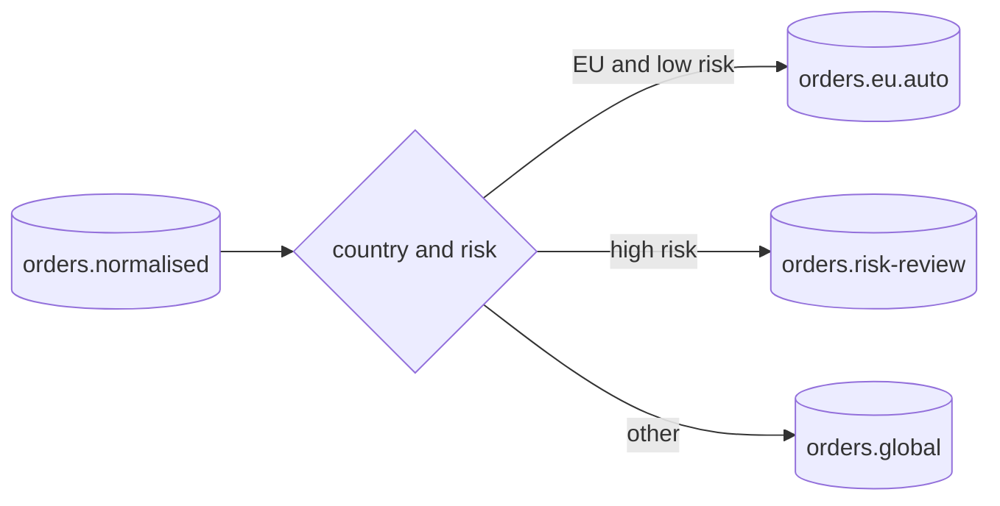

# Content-Based Router

> Route each message to an output channel by evaluating fields in the message content or headers against explicit business predicates.

**Scale:** integration · **Altitude:** medium · **Category:** enterprise-integration · **Maturity:** time-tested

## Description

A Content-Based Router is a Message Router whose decisions come from message data rather than static channel topology. It can route by order type, tenant, jurisdiction, risk score, schema version, or capability flags. The pattern is powerful because producers send a single message and the integration layer selects the correct path, but it also puts pressure on message contracts: routing predicates must use stable, well-defined fields. When those fields vary across systems, introduce a Message Translator or Canonical Data Model before routing.

**Problem.** Different consumers need messages that satisfy different business conditions, but asking every producer to know those conditions duplicates routing rules and causes inconsistent delivery.

**Context.** Use when integration flows branch on message attributes and those attributes are available reliably at routing time, ideally after validation and normalisation.

## Diagram



## Consequences / Trade-offs

- Keeps business routing policy central and testable.
- Reduces producer coupling to downstream consumer eligibility rules.
- Requires stable payload/header fields; schema drift can silently misroute messages.
- Complex predicates can hide business process decisions that belong in a Process Manager.

## Ratings by project size

| Project size | Score | Notes |
| --- | --- | --- |
| Small (<10k LOC) | ●●○○○ 2/5 | Often overkill when a small app has one path or can use ordinary in-process branching. |
| Medium (≤100k LOC) | ●●●●○ 4/5 | Strong fit when several message categories require different processing and contracts are stable. |
| Large (>100k LOC) | ●●●●● 5/5 | High value in large integration estates, but predicate governance and schema evolution are mandatory. |

## Examples

### Routing by stable canonical fields

**❌ Negative (java)**

```java
void publish(SourceOrder order) {
  String destination = order.getPayload().contains("GDPR")
    ? "orders.eu.auto"
    : "orders.global";
  kafka.send(destination, order);
}
```

**✅ Positive (java)**

```java
from("kafka:orders.normalised")
  .routeId("jurisdiction-router")
  .choice()
    .when(simple("${body.country} in 'DE,FR,ES' && ${body.riskScore} < 50"))
      .to("kafka:orders.eu.auto")
    .when(simple("${body.riskScore} >= 50"))
      .to("kafka:orders.risk-review")
    .otherwise()
      .to("kafka:orders.global");
```

*The positive route uses explicit canonical fields and named predicates. It avoids brittle text inspection and keeps changing routing policy in one integration component.*

## Relationships

**Synergies**

- [Message Router](../enterprise-integration/message-router.md) — Content-Based Router specialises Message Router with explicit predicates over message fields.
- [Canonical Data Model](../enterprise-integration/canonical-data-model.md) — Canonical fields make route predicates stable across heterogeneous producers.
- [Message Translator](../enterprise-integration/message-translator.md) — Translators normalise source-specific payloads before the router evaluates predicates.
- [Message Filter](../enterprise-integration/message-filter.md) — Filters can reject messages that match no useful path before they reach expensive consumers.

**Conflicts with:** [Transaction Script](../enterprise-application/transaction-script.md)

**Alternatives:** [Routing Slip](../enterprise-integration/routing-slip.md), [Process Manager](../enterprise-integration/process-manager.md), [Choreography](../cloud-distributed/choreography.md)

## Applicability tags

- **Languages:** language-agnostic, java, typescript
- **Frameworks:** spring-boot, kafka, rabbitmq
- **Project types:** microservices, distributed-system, backend-service, etl
- **Tags:** eip, routing, predicates, messaging

## References

- [Gregor Hohpe and Bobby Woolf, Enterprise Integration Patterns, (2003)](https://www.enterpriseintegrationpatterns.com/patterns/messaging/ContentBasedRouter.html)

