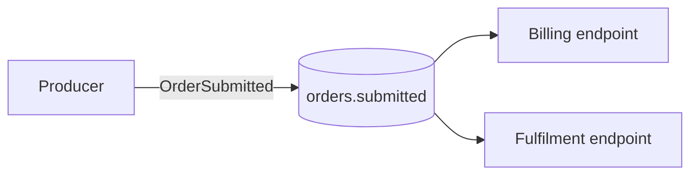

# Message Channel

> Connect applications through a named logical conduit so senders and receivers can exchange messages without knowing each other's location, protocol details, or runtime availability.

**Scale:** integration · **Altitude:** medium · **Category:** enterprise-integration · **Maturity:** time-tested

## Description

A Message Channel is the addressable path over which messages flow between integration participants. It may be implemented by a queue, topic, stream, mailbox, HTTP endpoint, or broker route, but the important design decision is logical: choose explicit channels for the kinds of conversations the system supports. A well-named channel expresses intent, ownership, delivery expectations, ordering assumptions, and payload contract. It decouples producers from consumers while still making coupling visible at the channel boundary.

**Problem.** Direct point-to-point calls hard-code addresses, timing, and protocols into each participant. As integrations grow, every producer needs to know every consumer and operational changes ripple through code rather than configuration.

**Context.** Use when two or more applications, services, or bounded contexts exchange asynchronous messages, especially when producers and consumers are owned independently or need buffering, fan-out, routing, or replay.

## Diagram



## Consequences / Trade-offs

- Decouples participants in space and time; either side can be deployed or scaled independently.
- Makes integration contracts visible through channel names, schemas, retention, ordering, and access rules.
- Introduces operational responsibilities for brokers, dead letters, retention, permissions, monitoring, and back-pressure.
- Channel sprawl becomes a governance problem unless ownership and naming conventions are explicit.

## Ratings by project size

| Project size | Score | Notes |
| --- | --- | --- |
| Small (<10k LOC) | ●●○○○ 2/5 | Usually unnecessary for a small single-process application unless it already uses a broker. |
| Medium (≤100k LOC) | ●●●●○ 4/5 | Valuable once several services exchange events and need buffering or independent deployment. |
| Large (>100k LOC) | ●●●●● 5/5 | Foundational for integration-heavy estates; channel governance becomes a core architecture concern. |

## Examples

### Naming a durable integration channel instead of embedding destinations

**❌ Negative (java)**

```java
class CheckoutService {
  void complete(Order order) {
    http.post("https://billing.internal/v1/orders", order);
    http.post("https://warehouse.internal/v1/reserve", order);
    http.post("https://crm.internal/v1/events", order);
  }
}
```

**✅ Positive (java)**

```java
@Component
class CheckoutService {
  private final StreamBridge bridge;

  CheckoutService(StreamBridge bridge) {
    this.bridge = bridge;
  }

  void complete(Order order) {
    OrderSubmitted event = OrderSubmitted.from(order);
    bridge.send("ordersSubmitted-out-0", event);
  }
}

// application.yml
// spring.cloud.stream.bindings.ordersSubmitted-out-0.destination=orders.submitted.v1
```

*The positive version publishes a business event to a logical channel. Billing, warehouse, and CRM can subscribe independently, and the checkout service no longer embeds their locations or call timing.*

## Relationships

**Synergies**

- [Message Endpoint](../enterprise-integration/message-endpoint.md) — Endpoints hide broker-specific APIs from business code while reading from and writing to channels.
- [Message Router](../enterprise-integration/message-router.md) — Routers consume from one channel and publish to other channels based on routing policy.
- [Publish-Subscribe Channel](../enterprise-integration/publish-subscribe.md) — A publish-subscribe channel lets many subscribers independently observe the same event stream.
- [Dead Letter Channel](../enterprise-integration/dead-letter-channel.md) — Failed messages need a separate failure channel with clear ownership and replay procedures.

**Conflicts with:** [Transaction Script](../enterprise-application/transaction-script.md)

**Alternatives:** [REST](../api-design/rest.md), [gRPC / RPC](../api-design/grpc-rpc.md), [Webhook](../api-design/webhook.md)

## Applicability tags

- **Languages:** language-agnostic, java, typescript
- **Frameworks:** kafka, rabbitmq, nats, spring-boot, nodejs
- **Project types:** microservices, distributed-system, backend-service, data-pipeline
- **Tags:** eip, messaging, decoupling, asynchronous

## References

- [Gregor Hohpe and Bobby Woolf, Enterprise Integration Patterns, (2003)](https://www.enterpriseintegrationpatterns.com/patterns/messaging/MessageChannel.html)

