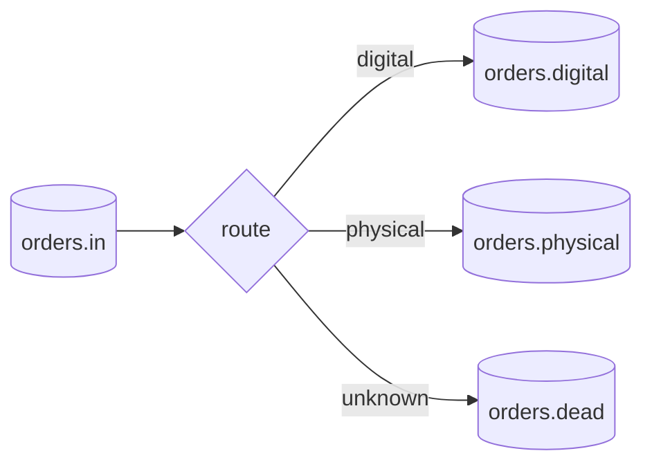

# Message Router

> Consume a message from one channel and forward it to one or more output channels without changing the message's essential meaning.

**Scale:** integration · **Category:** enterprise-integration · **Maturity:** time-tested

## Description

A Message Router centralises routing decisions that would otherwise be scattered across producers and consumers. It inspects message metadata, payload, configuration, or external state, then forwards the message to the next channel or endpoint. The router should be explicit about whether it is pure routing, enrichment, filtering, or transformation; mixing all of those responsibilities creates an opaque integration hub. Good routers keep routing policy testable and observable, preserve correlation data, and publish to stable logical channels.

**Problem.** Producers often embed conditional delivery logic for downstream systems. As consumers are added or rules change, every producer becomes coupled to integration topology and releases are required for what should be routing policy changes.

**Context.** Use when messages entering an integration flow need to be directed to different channels, services, or processing paths based on type, metadata, tenant, priority, region, or business rule.

## Diagram



## Consequences / Trade-offs

- Removes routing knowledge from producers and receivers, reducing direct coupling.
- Provides a single place to observe, test, and change routing policy.
- Can become a central bottleneck or rule graveyard if it also owns transformation, validation, and orchestration.
- Misrouting is often worse than failure; routes need metrics, traces, and safe defaults such as dead-letter handling.

## Ratings by project size

| Project size | Score | Notes |
| --- | --- | --- |
| Small (<10k LOC) | ●●○○○ 2/5 | Adds indirection for a small application with one or two fixed destinations. |
| Medium (≤100k LOC) | ●●●●○ 4/5 | Useful when several consumers or business categories need different processing paths. |
| Large (>100k LOC) | ●●●●● 5/5 | Essential in message-heavy estates, provided routing remains observable and not overloaded with orchestration. |

## Examples

### Keeping routing policy out of producers

**❌ Negative (java)**

```java
class OrderPublisher {
  void publish(Order order) {
    if (order.isDigital()) {
      kafka.send("orders.digital", order);
    } else if (order.requiresWarehouse()) {
      kafka.send("orders.physical", order);
    } else {
      kafka.send("orders.manual-review", order);
    }
  }
}
```

**✅ Positive (java)**

```java
from("kafka:orders.in")
  .routeId("order-router")
  .choice()
    .when(simple("${body.digital} == true")).to("kafka:orders.digital")
    .when(simple("${body.requiresWarehouse} == true")).to("kafka:orders.physical")
    .otherwise().to("kafka:orders.manual-review");
```

*The positive route lets producers emit one canonical order message while routing rules live in the integration layer, where they can be tested, changed, and monitored independently.*

## Relationships

**Synergies**

- [Content-Based Router](../enterprise-integration/content-based-router.md) — Content-Based Router is the common specialised form when routing is based on message fields.
- [Message Filter](../enterprise-integration/message-filter.md) — Filters can drop irrelevant messages before the router spends capacity on downstream dispatch.
- [Message Translator](../enterprise-integration/message-translator.md) — Translation should happen at route boundaries when different recipients require distinct contracts.
- [Message Channel](../enterprise-integration/message-channel.md) — Router outputs are stable logical channels rather than hard-coded destination addresses.

**Conflicts with:** [Choreography](../cloud-distributed/choreography.md)

**Alternatives:** [Routing Slip](../enterprise-integration/routing-slip.md), [Process Manager](../enterprise-integration/process-manager.md), [API Gateway](../architecture/api-gateway.md)

## Applicability tags

- **Languages:** language-agnostic, java, typescript
- **Frameworks:** spring-boot, kafka, rabbitmq, nodejs
- **Project types:** microservices, distributed-system, backend-service, high-throughput
- **Tags:** eip, messaging, routing, broker

## References

- [Gregor Hohpe and Bobby Woolf, Enterprise Integration Patterns, (2003)](https://www.enterpriseintegrationpatterns.com/patterns/messaging/MessageRouter.html)

