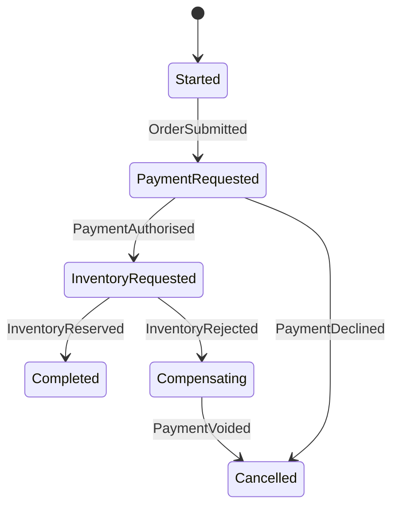

# Process Manager

> Maintain the state of a long-running integration process and decide which command or message should be sent next as events arrive.

**Scale:** integration · **Category:** enterprise-integration · **Maturity:** time-tested

## Description

A Process Manager is a stateful coordinator for an integration process that spans multiple systems, messages, and time. It listens for events, records process state, evaluates transition rules, sends commands, handles timeouts, and may trigger compensation. Unlike a Routing Slip, the future path is not fully known at the start; it depends on outcomes. Unlike pure Choreography, the coordination logic is explicit and observable in one component. The pattern is especially useful for sagas where business progress and compensating actions must be tracked reliably.

**Problem.** Long-running business processes often start in one service and continue through several asynchronous outcomes. If every participant decides the next step independently, the overall process becomes hard to understand, audit, timeout, or repair.

**Context.** Use when an integration flow has durable state, branching decisions based on intermediate results, timeouts, compensation, human review, or cross-service lifecycle visibility requirements.

## Diagram



## Consequences / Trade-offs

- Makes long-running process state, transitions, and timeouts explicit and observable.
- Centralises coordination while keeping participating services focused on local work.
- Introduces a stateful component that must be durable, idempotent, and operationally monitored.
- Can become a god orchestrator if it absorbs domain logic that belongs inside services.

## Ratings by project size

| Project size | Score | Notes |
| --- | --- | --- |
| Small (<10k LOC) | ●●○○○ 2/5 | Too much machinery for simple request/response or short synchronous workflows. |
| Medium (≤100k LOC) | ●●●●○ 4/5 | Strong fit for a few long-running asynchronous processes with compensation or human review. |
| Large (>100k LOC) | ●●●●● 5/5 | Excellent for complex integration estates where stateful orchestration and auditability matter. |

## Examples

### Coordinating a long-running order process explicitly

**❌ Negative (typescript)**

```typescript
bus.on("OrderSubmitted", async (event) => {
  await bus.publish("ReserveInventory", { orderId: event.orderId });
});

bus.on("InventoryReserved", async (event) => {
  await bus.publish("CapturePayment", { orderId: event.orderId });
});

bus.on("PaymentFailed", async (event) => {
  await bus.publish("ReleaseInventory", { orderId: event.orderId });
});
```

**✅ Positive (typescript)**

```typescript
class OrderProcessManager {
  async handle(event: OrderEvent): Promise<void> {
    const process = await store.load(event.orderId) ?? OrderProcess.start(event.orderId);
    const commands = process.apply(event);

    await store.save(process);
    for (const command of commands) {
      await bus.publish(command.type, { ...command.payload, correlationId: process.id });
    }
  }
}

class OrderProcess {
  apply(event: OrderEvent): Command[] {
    switch (`${this.state}:${event.type}`) {
      case "STARTED:OrderSubmitted":
        this.state = "PAYMENT_REQUESTED";
        return [{ type: "AuthorisePayment", payload: { orderId: this.id } }];
      case "PAYMENT_REQUESTED:PaymentAuthorised":
        this.state = "INVENTORY_REQUESTED";
        return [{ type: "ReserveInventory", payload: { orderId: this.id } }];
      case "INVENTORY_REQUESTED:InventoryRejected":
        this.state = "COMPENSATING";
        return [{ type: "VoidPayment", payload: { orderId: this.id } }];
      default:
        return [];
    }
  }
}
```

*The positive version stores process state and emits commands from explicit transitions. The process can be audited, timed out, retried, and compensated without reconstructing behaviour from scattered event handlers.*

## Relationships

**Synergies**

- [Saga](../cloud-distributed/saga.md) — A Process Manager is a common orchestration implementation for sagas with compensation.
- [Routing Slip](../enterprise-integration/routing-slip.md) — It can emit routing slips for predictable subflows while retaining stateful control of the larger process.
- [Message Endpoint](../enterprise-integration/message-endpoint.md) — Endpoints adapt incoming events and outgoing commands while the manager owns process state.
- [Correlation Identifier](../enterprise-integration/correlation-identifier.md) — Every event and command must correlate to a process instance.

**Conflicts with:** [Choreography](../cloud-distributed/choreography.md)

**Alternatives:** [Routing Slip](../enterprise-integration/routing-slip.md), [Choreography](../cloud-distributed/choreography.md), [Application Controller](../enterprise-application/application-controller.md)

## Applicability tags

- **Languages:** language-agnostic, java, typescript, csharp
- **Frameworks:** spring-boot, kafka, nodejs, dotnet
- **Project types:** microservices, distributed-system, backend-service, safety-critical
- **Tags:** eip, orchestration, workflow, state-machine

## References

- [Gregor Hohpe and Bobby Woolf, Enterprise Integration Patterns, (2003)](https://www.enterpriseintegrationpatterns.com/patterns/messaging/ProcessManager.html)

