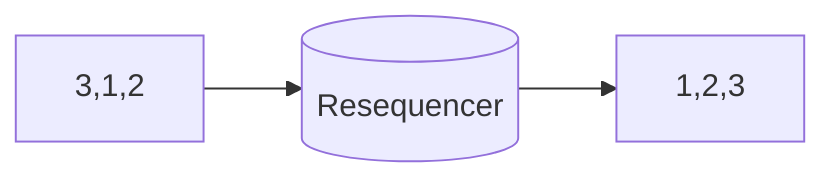

# Resequencer

> Reorder related messages into a required sequence before forwarding them to a consumer that cannot safely process out-of-order messages.

**Scale:** integration · **Altitude:** medium · **Category:** enterprise-integration · **Maturity:** time-tested

## Description

A Resequencer buffers messages for a correlation group and releases them in sequence-number, timestamp, or domain-order order. It is needed when channels or parallel processors do not preserve order but downstream state transitions depend on it. The design must specify the ordering key, gap handling, maximum buffer size, and timeout for missing messages. A resequencer should not be used to paper over unclear domain semantics; if order is not truly required, prefer idempotent and commutative processing.

**Problem.** Distributed messaging can deliver messages out of order because of retries, partitions, competing consumers, or parallel routes. Some receivers, such as ledger or lifecycle processors, produce wrong results if they observe events in the wrong order.

**Context.** Use when related messages carry sequence metadata and a receiver has a genuine ordering requirement that cannot be removed by making processing idempotent or commutative.

## Diagram



## Consequences / Trade-offs

- Protects order-sensitive consumers from invalid state transitions.
- Requires buffering and state, increasing latency and memory/storage pressure.
- Missing messages can block a group unless timeout and skip policies are explicit.
- Ordering often reduces throughput; partitioning by correlation key can be a simpler alternative.

## Ratings by project size

| Project size | Score | Notes |
| --- | --- | --- |
| Small (<10k LOC) | ●○○○○ 1/5 | Avoid unless there is a proven ordering bug; it adds latency and state. |
| Medium (≤100k LOC) | ●●●○○ 3/5 | Situational for lifecycle or ledger flows with sequence metadata. |
| Large (>100k LOC) | ●●●●○ 4/5 | Valuable for order-sensitive integration streams, but partitioning and idempotency should be considered first. |

## Examples

### Releasing account events in sequence order

**❌ Negative (java)**

```java
@KafkaListener(topics = "account.events")
void on(AccountEvent event) {
  ledger.apply(event); // balance may be wrong if debit #3 arrives before credit #2
}
```

**✅ Positive (java)**

```java
from("kafka:account.events")
  .routeId("account-resequencer")
  .resequence(header("sequenceNumber"))
    .batch()
    .size(100)
    .timeout(2000)
  .to("kafka:account.events.ordered");
```

*The positive route buffers events and releases them by sequence number with a timeout. The ledger consumes from an ordered channel instead of assuming broker delivery order is sufficient.*

## Relationships

**Synergies**

- [Correlation Identifier](../enterprise-integration/correlation-identifier.md) — The resequencer needs a group key to avoid ordering unrelated messages together.
- [Splitter](../enterprise-integration/splitter.md) — Split messages often carry sequence numbers that a resequencer can restore later.
- [Idempotent Receiver](../enterprise-integration/idempotent-receiver.md) — Duplicate sequence numbers should be ignored before releasing ordered messages.
- [Message Channel](../enterprise-integration/message-channel.md) — Ordered output is usually published to a separate channel with stricter consumer expectations.

**Conflicts with:** [Competing Consumers](../cloud-distributed/competing-consumers.md)

**Alternatives:** [Idempotency](../resilience/idempotency.md), [Actor Model](../concurrency/actor-model.md), [Aggregator](../enterprise-integration/aggregator.md)

## Applicability tags

- **Languages:** language-agnostic, java, typescript
- **Frameworks:** spring-boot, kafka, redis
- **Project types:** distributed-system, microservices, data-pipeline, high-throughput
- **Tags:** eip, ordering, buffering, sequencing

## References

- [Gregor Hohpe and Bobby Woolf, Enterprise Integration Patterns, (2003)](https://www.enterpriseintegrationpatterns.com/patterns/messaging/Resequencer.html)

