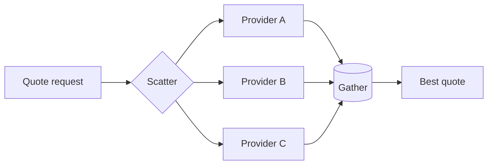

# Scatter-Gather

> Send a request to multiple recipients in parallel, collect the responses, and continue with a combined, best, quorum, or first-success result.

**Scale:** integration · **Category:** enterprise-integration · **Maturity:** time-tested

## Description

Scatter-Gather fans a message out to multiple recipients and gathers their replies according to a completion policy. It is useful for quoting, search federation, inventory checks, fraud signals, or capability discovery where several providers can answer the same request. The pattern must define recipient selection, correlation ids, response timeout, quorum or completeness rule, duplicate handling, and how partial results are represented. It is not a substitute for a clear owning service when one system should make the decision.

**Problem.** Sequentially calling several providers increases latency and hard-codes provider knowledge in the requester. Fire-and-forget fan-out loses the ability to make a decision from the responses.

**Context.** Use when independent recipients can process the same request concurrently and the caller needs a combined or selected response within a bounded time.

## Diagram



## Consequences / Trade-offs

- Reduces latency by parallelising independent provider calls.
- Allows best-response, quorum, or partial-result policies rather than all-or-nothing behaviour.
- Requires correlation, aggregation state, timeouts, and provider-level resilience.
- Fan-out can amplify load; apply rate limits and circuit breakers to providers.

## Ratings by project size

| Project size | Score | Notes |
| --- | --- | --- |
| Small (<10k LOC) | ●●○○○ 2/5 | Rarely justified unless latency across multiple providers is a clear problem. |
| Medium (≤100k LOC) | ●●●●○ 4/5 | Good fit for federated search, quote, and signal collection flows. |
| Large (>100k LOC) | ●●●●● 5/5 | Excellent for large provider ecosystems, but load amplification and partial-result semantics must be designed carefully. |

## Examples

### Parallel quote collection with bounded gather time

**❌ Negative (java)**

```java
Quote getBestQuote(QuoteRequest request) {
  List<Quote> quotes = new ArrayList<>();
  quotes.add(providerA.quote(request));
  quotes.add(providerB.quote(request));
  quotes.add(providerC.quote(request));
  return bestOf(quotes);
}
```

**✅ Positive (java)**

```java
from("direct:quote-request")
  .routeId("quote-scatter-gather")
  .setHeader("quoteRequestId", simple("${exchangeId}"))
  .multicast().parallelProcessing()
    .to("direct:provider-a", "direct:provider-b", "direct:provider-c")
  .end()
  .aggregate(header("quoteRequestId"), new BestQuoteAggregationStrategy())
    .completionTimeout(1500)
  .to("kafka:quotes.best");
```

*The positive route runs providers concurrently and bounds the gather phase. It can return the best available quote instead of blocking on the slowest provider.*

## Relationships

**Synergies**

- [Aggregator](../enterprise-integration/aggregator.md) — Aggregator implements the gather phase by collecting correlated responses.
- [Message Router](../enterprise-integration/message-router.md) — A router can select which recipients receive each scatter request.
- [Correlation Identifier](../enterprise-integration/correlation-identifier.md) — Every request and response needs a shared id so the gather phase is safe.
- [Circuit Breaker](../resilience/circuit-breaker.md) — Circuit breakers prevent failing recipients from dominating gather latency and error rates.

**Conflicts with:** [Choreography](../cloud-distributed/choreography.md)

**Alternatives:** [Gateway Aggregation](../cloud-distributed/gateway-aggregation.md), [Request-Reply](../enterprise-integration/request-reply.md), [Process Manager](../enterprise-integration/process-manager.md)

## Applicability tags

- **Languages:** language-agnostic, java, typescript
- **Frameworks:** spring-boot, kafka, rabbitmq, nodejs
- **Project types:** microservices, distributed-system, backend-service, low-latency
- **Tags:** eip, fan-out, fan-in, parallelism

## References

- [Gregor Hohpe and Bobby Woolf, Enterprise Integration Patterns, (2003)](https://www.enterpriseintegrationpatterns.com/patterns/messaging/BroadcastAggregate.html)

