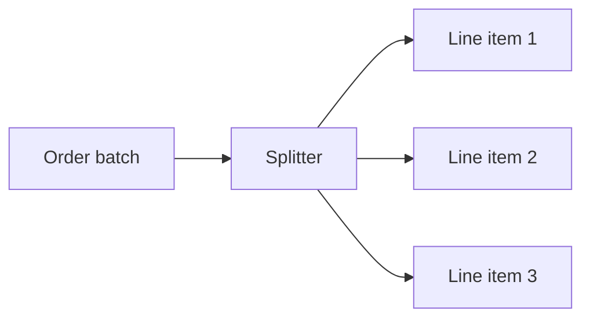

# Splitter

> Break a composite message into a sequence of smaller messages so each part can be processed independently and, if needed, correlated back to the original.

**Scale:** integration · **Category:** enterprise-integration · **Maturity:** time-tested

## Description

A Splitter takes a message containing multiple logical items and emits one message per item, usually adding correlation metadata such as parent id, sequence number, and expected count. It is common for batch files, orders with line items, multi-record API payloads, or documents with independent sections. The splitter should define whether all child messages must succeed, whether order matters, and how downstream failures are reconciled. Without correlation metadata, later aggregation, audit, and error handling are fragile.

**Problem.** Downstream processors often work on one logical item at a time, but upstream systems send batches or documents. Processing the whole composite message in one consumer limits parallelism and makes partial failure handling crude.

**Context.** Use when a composite message contains independently processable elements and each element should be routed, transformed, retried, or scaled separately.

## Diagram



## Consequences / Trade-offs

- Enables parallel processing, item-level retries, and more precise error reporting.
- Requires correlation identifiers and sequence metadata if results must be reconstructed.
- Can multiply message volume dramatically; downstream channels must handle the fan-out.
- Partial failures need explicit policy: compensate, aggregate errors, or continue with accepted items.

## Ratings by project size

| Project size | Score | Notes |
| --- | --- | --- |
| Small (<10k LOC) | ●●○○○ 2/5 | Usually unnecessary unless the small system already has batch/document integrations. |
| Medium (≤100k LOC) | ●●●●○ 4/5 | Useful for item-level scaling and failure handling in batch-heavy services. |
| Large (>100k LOC) | ●●●●● 5/5 | Excellent fit for large integration flows, but message amplification and correlation must be engineered deliberately. |

## Examples

### Splitting a submitted order into line-item work messages

**❌ Negative (java)**

```java
void handle(OrderSubmitted order) {
  for (LineItem item : order.items()) {
    inventory.reserve(item.sku(), item.quantity());
    pricing.price(item);
    warehouse.pick(item);
  }
}
```

**✅ Positive (java)**

```java
from("kafka:orders.submitted")
  .routeId("order-line-splitter")
  .split(simple("${body.items}"))
    .setHeader("correlationId", simple("${exchangeProperty.CamelSplitCorrelationId}"))
    .setHeader("sequenceNumber", simple("${exchangeProperty.CamelSplitIndex}"))
    .setHeader("sequenceSize", simple("${exchangeProperty.CamelSplitSize}"))
    .to("kafka:order.line-items");
```

*The positive route emits independently processable line-item messages and carries correlation metadata so downstream processing can be retried, routed, and aggregated safely.*

## Relationships

**Synergies**

- [Aggregator](../enterprise-integration/aggregator.md) — Aggregator is the natural counterpart when split results must be recombined.
- [Correlation Identifier](../enterprise-integration/correlation-identifier.md) — Split children need a parent correlation id so results can be tracked and grouped.
- [Message Router](../enterprise-integration/message-router.md) — Each split child can be routed independently according to type or content.
- [Message Filter](../enterprise-integration/message-filter.md) — Invalid child items can be rejected without discarding the whole composite message.

**Conflicts with:** [Transaction Script](../enterprise-application/transaction-script.md)

**Alternatives:** [Pipes and Filters](../architecture/pipes-and-filters.md), [Message Filter](../enterprise-integration/message-filter.md)

## Applicability tags

- **Languages:** language-agnostic, java, typescript
- **Frameworks:** spring-boot, kafka, rabbitmq
- **Project types:** data-pipeline, etl, microservices, high-throughput
- **Tags:** eip, fan-out, batch, correlation

## References

- [Gregor Hohpe and Bobby Woolf, Enterprise Integration Patterns, (2003)](https://www.enterpriseintegrationpatterns.com/patterns/messaging/Sequencer.html)

