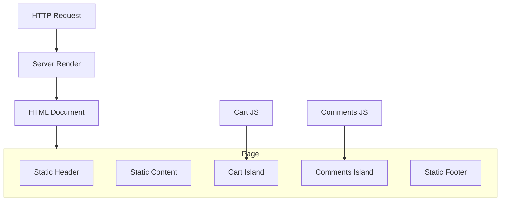

# Islands Architecture

> Serve mostly static or server-rendered HTML and hydrate only isolated interactive components, leaving the rest of the page inert.

**Scale:** architectural · **Category:** frontend · **Maturity:** emerging

**Also known as:** Partial Hydration, Component Islands

## Description

Islands Architecture treats a page as a static or server-rendered document with discrete interactive islands embedded inside it. Each island owns its client JavaScript and hydration boundary, while the surrounding content remains plain HTML. The pattern improves load performance for content-heavy sites that need pockets of interactivity, but it requires careful contracts for data flow between server-rendered content and hydrated components.

**Problem.** Full-page hydration ships and executes JavaScript for content that does not need client-side behaviour, slowing down pages and increasing failure modes.

**Context.** Use for content sites, commerce landing pages, documentation, dashboards with isolated widgets, and applications where most of the screen is read-only but selected regions are interactive.

## Diagram



## Consequences / Trade-offs

- Reduces JavaScript cost by hydrating only interactive regions.
- Preserves SSR benefits for content, SEO and resilience.
- Cross-island communication can become awkward without a deliberate event or state boundary.
- Not ideal for highly interactive apps where most of the page shares live client state.

## Ratings by project size

| Project size | Score | Notes |
| --- | --- | --- |
| Small (<10k LOC) | ●●●○○ 3/5 | Good for small content-heavy sites if the framework makes islands simple; otherwise static HTML plus small scripts may suffice. |
| Medium (≤100k LOC) | ●●●●○ 4/5 | Strong fit for marketing, docs and commerce pages with isolated interactive widgets. |
| Large (>100k LOC) | ●●●○○ 3/5 | Useful for performance-sensitive surfaces, but less suitable for large app-like screens with dense shared client state. |

## Examples

### Hydrating only the interactive cart widget

**❌ Negative (typescript)**

```typescript
import { hydrateRoot } from "react-dom/client";
import { Page } from "./Page";

hydrateRoot(document, <Page />);
```

**✅ Positive (typescript)**

```typescript
import { hydrateRoot } from "react-dom/client";
import { CartWidget } from "./CartWidget";

const cart = document.querySelector("[data-island='cart']");
if (cart) {
  hydrateRoot(cart, <CartWidget initialCount={Number(cart.getAttribute("data-count"))} />);
}
```

*The positive version leaves server-rendered article, header and footer as plain HTML while shipping client JavaScript only for the cart island that needs interaction.*

## Relationships

**Synergies**

- [Server-Side Rendering](../frontend/server-side-rendering.md) — Islands usually start from server-rendered HTML and selectively hydrate interactive components.
- [Component-Based UI](../frontend/component-based-ui.md) — Each island is a component boundary with its own client runtime contract.
- [Lazy Load](../enterprise-application/lazy-load.md) — Islands can defer loading JavaScript until visible, idle or interacted with.
- [Observer](../gof-behavioural/observer.md) — Islands that need coordination can observe browser events or shared stores without hydrating the whole page.

**Alternatives:** [Server-Side Rendering](../frontend/server-side-rendering.md), [Micro-Frontends](../frontend/micro-frontends.md), [Client-Server](../architecture/client-server.md)

## Applicability tags

- **Languages:** typescript, javascript
- **Frameworks:** react, vue, svelte, solidjs, nextjs
- **Project types:** web-frontend, web-api, serverless
- **Tags:** partial-hydration, performance, progressive-enhancement

## References

- [Jason Miller, Islands Architecture, (2020)](https://jasonformat.com/islands-architecture/)

