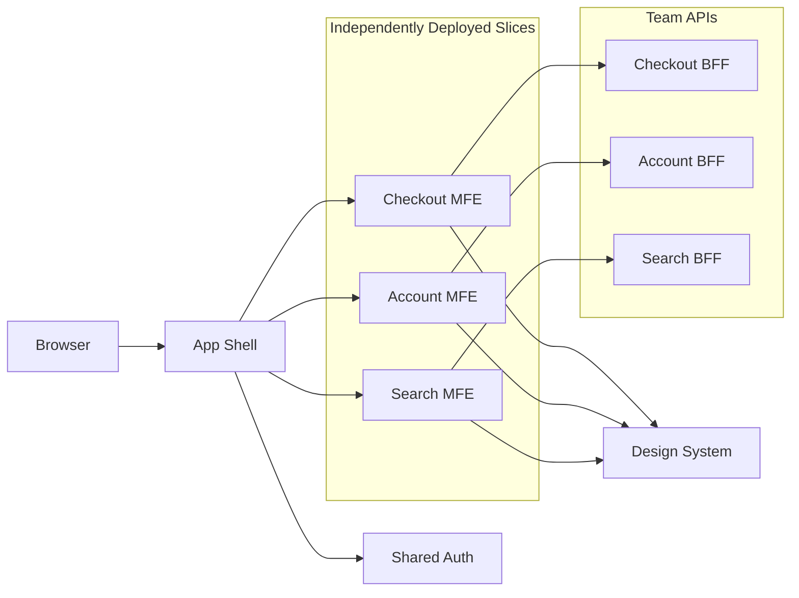

# Micro-Frontends

> Split a frontend into independently owned, built and deployed slices that compose into one user experience at runtime or build time.

**Scale:** architectural · **Altitude:** high · **Category:** frontend · **Maturity:** established

**Also known as:** Frontend Microservices

## Description

Micro-Frontends apply the microservice ownership model to the browser-facing application. Each slice owns a bounded product area, its UI code, tests and release cadence; a shell or composition layer integrates the slices through routing, module federation, server-side includes or web components. The pattern is justified by organisational scale and independent delivery needs, not by a desire to make frontend code smaller.

**Problem.** A single frontend monolith can become a coordination bottleneck where unrelated teams queue behind one build, one deploy pipeline and one shared dependency graph.

**Context.** Use when multiple autonomous teams own distinct journeys, need independent releases, and can invest in platform contracts for routing, design system, authentication, observability and shared runtime policy.

## Diagram



## Consequences / Trade-offs

- Enables independent team delivery and incremental migration of legacy frontends.
- Aligns UI ownership with bounded contexts or product domains.
- Adds runtime integration, versioning, performance and consistency challenges.
- Requires strong platform governance; otherwise users experience a stitched-together product.

## Ratings by project size

| Project size | Score | Notes |
| --- | --- | --- |
| Small (<10k LOC) | ●○○○○ 1/5 | Avoid for small products; it adds distributed-system problems without enough organisational payoff. |
| Medium (≤100k LOC) | ●●○○○ 2/5 | Rarely justified unless teams already have independent release constraints or a migration need. |
| Large (>100k LOC) | ●●●●○ 4/5 | Good fit for large organisations with autonomous product teams, provided platform contracts and performance budgets are enforced. |

## Examples

### Routing by product boundary instead of importing every feature

**❌ Negative (typescript)**

```typescript
import { CheckoutApp } from "../checkout/App";
import { AccountApp } from "../account/App";
import { SearchApp } from "../search/App";

export function App() {
  return <Routes>
    <Route path="/checkout/*" element={<CheckoutApp />} />
    <Route path="/account/*" element={<AccountApp />} />
    <Route path="/search/*" element={<SearchApp />} />
  </Routes>;
}
```

**✅ Positive (typescript)**

```typescript
const remotes = {
  checkout: () => import("checkout/App"),
  account: () => import("account/App"),
  search: () => import("search/App"),
};

export function AppShell() {
  return <Routes>
    <Route path="/checkout/*" element={<RemoteApp load={remotes.checkout} />} />
    <Route path="/account/*" element={<RemoteApp load={remotes.account} />} />
    <Route path="/search/*" element={<RemoteApp load={remotes.search} />} />
  </Routes>;
}
```

*The positive shell depends on stable remote contracts, allowing each product slice to build and deploy independently while still composing under shared routing.*

## Relationships

**Synergies**

- [Bounded Context](../ddd-strategic/bounded-context.md) — Product-aligned boundaries prevent micro-frontends from slicing by technical layer.
- [API Gateway](../architecture/api-gateway.md) — A gateway or BFF can provide stable backend contracts for independently deployed UI slices.
- [Backend for Frontend (BFF)](../architecture/backend-for-frontend.md) — Team-owned BFFs avoid forcing all slices through one generic API shape.
- [Component-Based UI](../frontend/component-based-ui.md) — Shared component contracts keep independently delivered slices visually coherent.

**Conflicts with:** [Shared Kernel](../ddd-strategic/shared-kernel.md)

**Alternatives:** [Modular Monolith](../architecture/modular-monolith.md), [Monolith](../architecture/monolith.md), [Component-Based UI](../frontend/component-based-ui.md)

## Applicability tags

- **Languages:** typescript, javascript
- **Frameworks:** react, vue, angular, svelte, nextjs
- **Project types:** web-frontend, distributed-system, microservices
- **Tags:** independent-deployment, frontend-architecture, team-boundaries

## References

- [Cam Jackson, Micro Frontends, (2019)](https://martinfowler.com/articles/micro-frontends.html)

