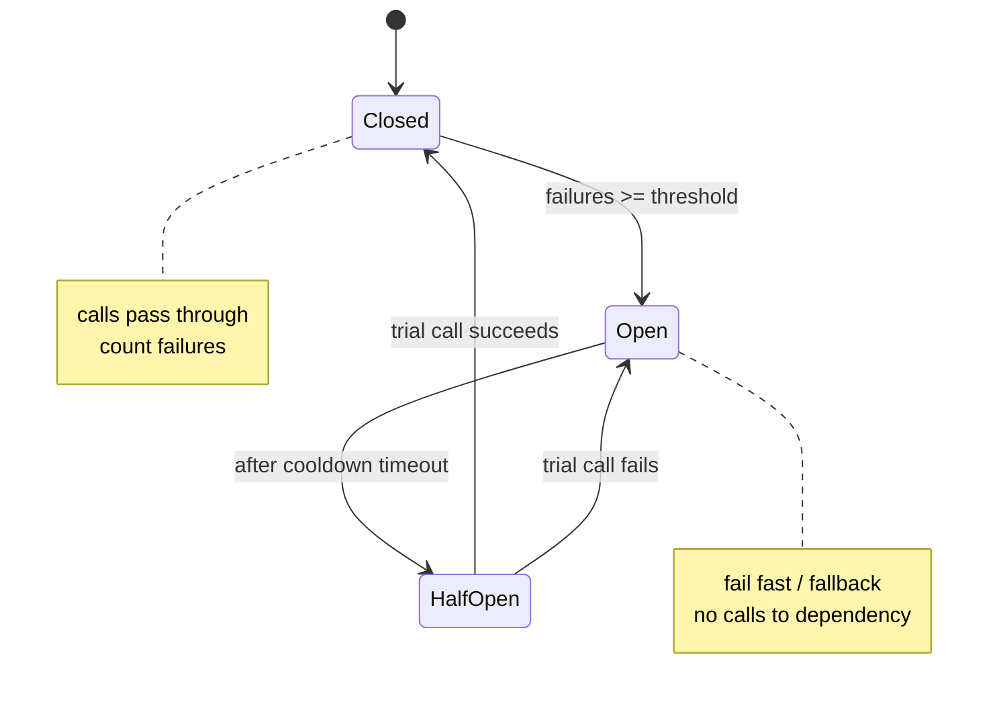

# Circuit Breaker

> Wrap calls to a failing remote dependency so that, after a failure threshold, calls are short-circuited for a cool-down period, protecting the caller and giving the dependency time to recover.

**Scale:** integration · **Category:** resilience · **Maturity:** time-tested

## Description

A circuit breaker monitors calls to a protected operation. In CLOSED state calls pass through and failures are counted; once failures exceed a threshold it trips to OPEN and fails fast without calling the dependency. After a timeout it moves to HALF-OPEN and allows a trial call: success closes the circuit, failure re-opens it. This prevents a struggling dependency from being hammered and stops failures from cascading and exhausting caller resources (threads, connections).

**Problem.** When a remote dependency is slow or down, naive retrying piles on load, ties up caller threads/connections, and lets failures cascade through the system.

**Context.** Synchronous calls across process/network boundaries to dependencies that can fail or become slow (HTTP APIs, databases, message brokers).

## Diagram



## Consequences / Trade-offs

- Fails fast during outages, freeing caller resources and improving stability.
- Gives the failing dependency room to recover (no thundering herd).
- Requires tuning thresholds/timeouts; bad values cause flapping or sluggish recovery.
- Needs a sensible fallback for the open state (cached value, default, error).

## Ratings by project size

| Project size | Score | Notes |
| --- | --- | --- |
| Small (<10k LOC) | ●●○○○ 2/5 | Rarely needed in small single-process apps/libraries with no remote calls. |
| Medium (≤100k LOC) | ●●●●○ 4/5 | Valuable once you have a few critical remote dependencies; use a library, don't hand-roll. |
| Large (>100k LOC) | ●●●●● 5/5 | Essential in distributed systems/microservices to prevent cascading failure. |

## Examples

### Protecting an HTTP dependency

**❌ Negative (typescript)**

```typescript
// Every request hits the dead service; retries amplify load and exhaust the pool.
async function getRate(): Promise<number> {
  for (let i = 0; i < 3; i++) {
    try {
      return (await http.get("https://fx.example/usd")).data.rate;
    } catch {
      /* retry immediately, even if the service is hard-down */
    }
  }
  throw new Error("fx unavailable");
}
```

**✅ Positive (typescript)**

```typescript
const breaker = new CircuitBreaker(() => http.get("https://fx.example/usd"), {
  failureThreshold: 5,
  cooldownMs: 30_000,
  timeoutMs: 1_000,
});

async function getRate(): Promise<number> {
  try {
    return (await breaker.fire()).data.rate;   // fails fast while OPEN
  } catch {
    return lastKnownRate;                      // fallback: degraded but available
  }
}
```

*The positive version stops calling a hard-down dependency after repeated failures and serves a fallback, protecting caller resources and the dependency.*

## Relationships

**Synergies**

- [Retry with Backoff](../resilience/retry.md) — Retry handles transient blips; the breaker stops retries once failures are systemic.
- [Bulkhead](../resilience/bulkhead.md) — Bulkheads isolate resources so a tripped dependency cannot exhaust shared pools.
- [Timeout](../resilience/timeout.md) — Timeouts bound each call so the breaker can detect slowness, not just errors.
- [Fallback](../resilience/fallback.md) — A fallback supplies a degraded response while the circuit is open.

## Applicability tags

- **Languages:** language-agnostic, java, csharp, go, typescript, python
- **Frameworks:** spring-boot, dotnet, nodejs, istio, grpc
- **Project types:** microservices, distributed-system, backend-service, web-api
- **Tags:** resilience, fault-tolerance, stability, state-machine

## References

- Michael T. Nygard, Release It! Design and Deploy Production-Ready Software, (2007)
- [Microsoft Azure Architecture Center; Circuit Breaker pattern](https://learn.microsoft.com/azure/architecture/patterns/circuit-breaker)

