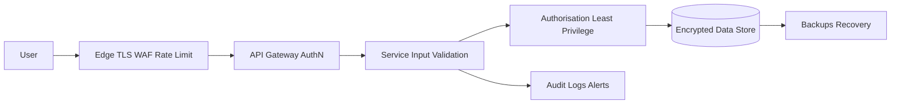

# Defense in Depth

> Protect important assets with multiple independent controls so one failed or bypassed defence does not expose the whole system.

**Scale:** architectural · **Category:** security · **Maturity:** time-tested

**Also known as:** Layered security

## Description

Defense in Depth layers preventive, detective, and responsive controls across the request path, runtime, data store, and operations. No single control is assumed perfect: input validation may miss a case, authentication may be misconfigured, a dependency may be vulnerable, or credentials may leak. Independent layers such as network segmentation, identity checks, least privilege, output encoding, encryption, monitoring, and incident response reduce the chance that one flaw becomes a breach.

**Problem.** Systems that rely on one perimeter, one validator, or one identity check fail catastrophically when that control is bypassed.

**Context.** Use for internet-facing, regulated, multi-tenant, or business-critical systems where compromise impact is high.

## Diagram



## Consequences / Trade-offs

- Reduces single points of security failure and limits blast radius.
- Combines prevention with detection and response.
- Adds operational complexity; overlapping controls must be intentional rather than contradictory or purely ceremonial.

## Ratings by project size

| Project size | Score | Notes |
| --- | --- | --- |
| Small (<10k LOC) | ●●○○○ 2/5 | Often too much architecture for tiny internal tools, though basic layering still matters. |
| Medium (≤100k LOC) | ●●●●○ 4/5 | Strong fit for exposed or sensitive services; keep controls simple and observable. |
| Large (>100k LOC) | ●●●●● 5/5 | Essential for large, regulated, or multi-tenant systems where single-control failure is expected. |

## Examples

### Layering controls in a Spring endpoint

**❌ Negative (java)**

```java
@GetMapping("/admin/users/{id}")
UserDto adminUser(@PathVariable String id) {
  // Assumes the firewall only allows administrators to reach this route.
  return users.findDto(id);
}
```

**✅ Positive (java)**

```java
@PreAuthorize("hasAuthority('users:admin:read')")
@GetMapping("/admin/users/{id}")
UserDto adminUser(@PathVariable @Pattern(regexp = "[a-zA-Z0-9-]{1,64}") String id,
                  Authentication auth) {
  audit.info("admin_user_read", Map.of("actor", auth.getName(), "target", id));
  return users.findDto(id);
}
```

*The positive endpoint does not trust the network layer alone. It adds route-level authorisation, input validation, and audit logging so bypassing one control is not enough.*

## Relationships

**Synergies**

- [Principle of Least Privilege](../security/least-privilege.md) — Privilege boundaries are a core inner layer that limits damage after an outer layer fails.
- [Input Validation (Allow-List)](../security/input-validation.md) — Allow-list validation is an early application-layer defence against malformed or hostile input.
- [Output Encoding](../security/output-encoding.md) — Encoding protects rendering sinks even when unsafe data reaches them.
- [Audit Logging](../security/audit-logging.md) — Detective controls show when preventive layers fail or are probed.

**Alternatives:** [Secure by Default](../security/secure-by-default.md)

## Applicability tags

- **Languages:** language-agnostic, javascript, typescript, python, java
- **Frameworks:** none, nodejs, express, spring-boot, kubernetes, istio
- **Project types:** web-api, backend-service, microservices, distributed-system, high-throughput
- **Tags:** layered-security, blast-radius, architecture

